This project utilizes Flutter as the frontend framework, employing the BLoC state management pattern for efficient state handling. We have implemented a solid architecture consisting of distinct layers: UI (screens, widgets), Controller (BLoCs, events, states), and Data (web services, repositories, models).

In our architecture, the screen requests a specific state from the controller. The controller communicates with the repository, which interacts with the web services. Upon receiving the response from the web services, the repository updates the model, which is then consumed by the controller and passed back to the screen for display.

For the backend, we opted for Spring, structured around entities, repositories, services, and web services. This architecture enables clear separation of concerns, allowing for scalable and maintainable code. The @RestResourceController annotation facilitates the creation of RESTful APIs, which allow the frontend to interact seamlessly with the backend. We chose MySQL for our database, initializing our project with random data while adhering to all established rules to avoid conflicts.

# Class Diagram

#Screens of the Application

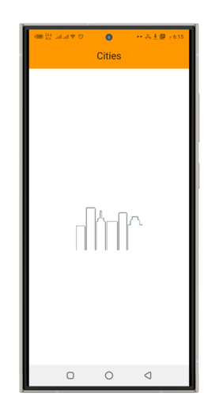

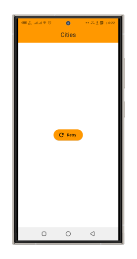

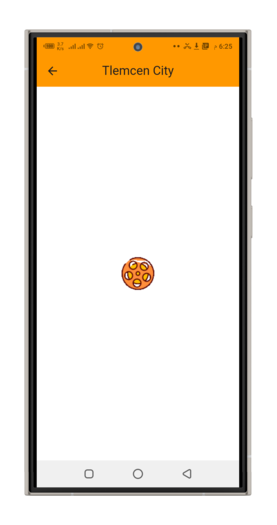

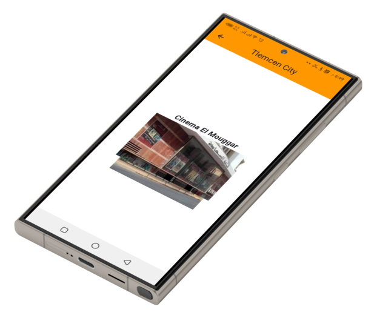

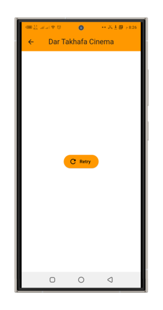

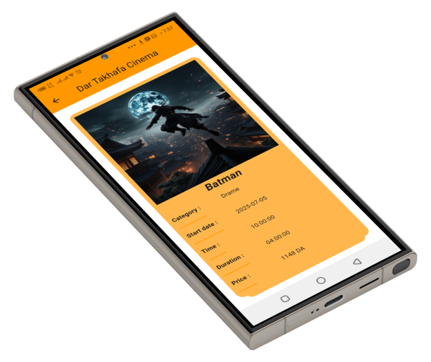

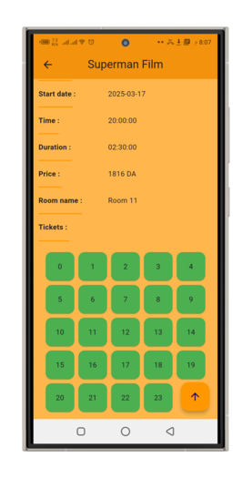

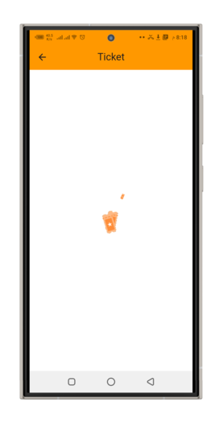

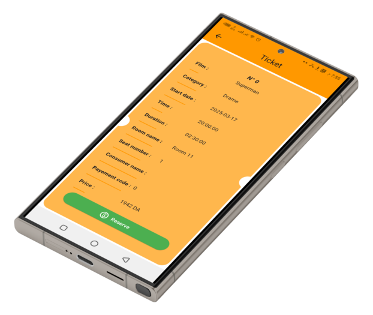

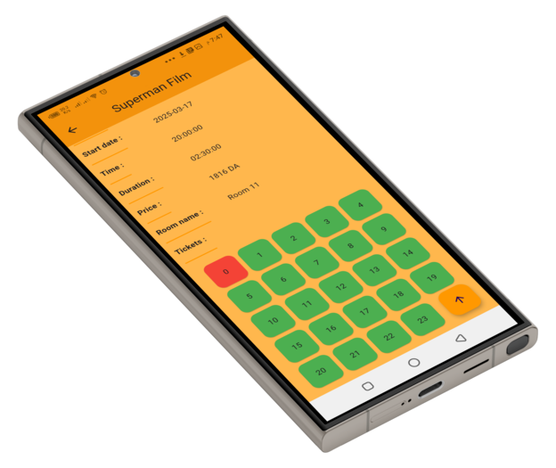

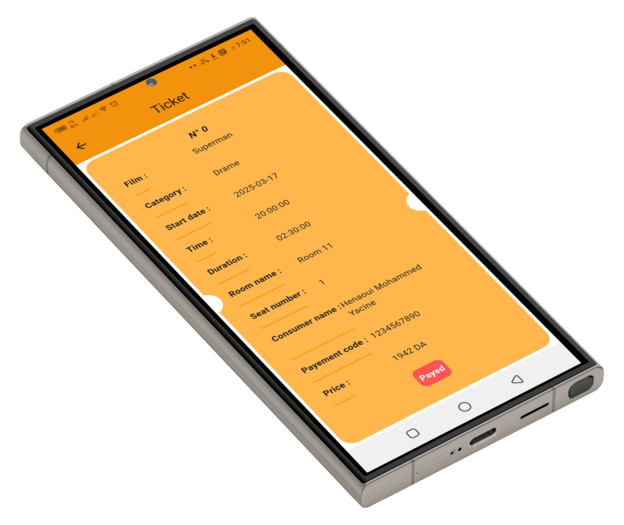

# Requirements

- **Java 21**
- **MySQL** (Installed and running)
- **Dart SDK**
- **Flutter SDK**

# Run backend:

